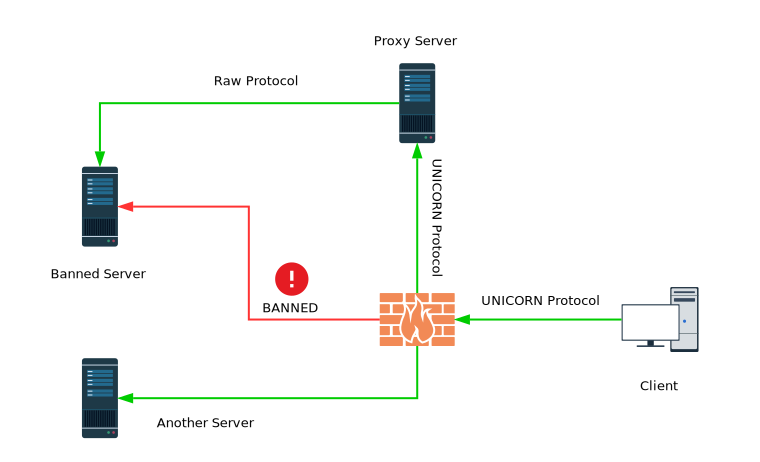

### UNICORN - 一个娇小的TC/UDP中继


基于asyncio，最终代码只有约250行，应该算是挺小的了，但是完整的实现了UDP/TCP的中继代理并且支持IPV6代理。使用了基于SOCKS5的自定义传输协议，支持 服务端<->客户端 的数据传输加密。目前实现了代理服务器端程序，以及一个基于此代理协议实现的SOCKS5客户端程序（暂未实现UDP）。后续会继续实现其他功能。

### 依赖 / 平台
可以正常运行于安装了 `Python 3.4 +` 版本的Windows/Linux。如果无需传输加密的话，无依赖任何第三方包。默认依赖 pycrypto。

### 原理

> 工作原理类似 Shadowsocks，看图理解不多赘述。



### 协议

 请求/响应的数据包都有着以下的结构，底列代表字段长度（字节数）

 > 需要知道的是，进入TCP中继模式后，数据包没有上述格式，所有数据都是原封转发。

    |  SIGN  | CMD/FRAG/ERR | ATYPE | ALEN | ADDR | PORT | DATA |
    |-----------------------------------------------------------|
    |   `PK`  |       1      |   1   |   1  |  ..  |  2   |  ..  |

  * `SIGN` 一个用来识别包的特征值，它是一个常量`PK`（两字节ASCII，`PACKET`）
  * `CMD/FRAG/ERR` 协议为TCP时该字段表示请求命令，否则代表UDP包序号，UDP包排序不进行实现，所以该字段无效
  * `ATYPE` 地址类型[ADDR_DOMAIN, ADDR_IPV4, ADDR_IPV6]
  * `ALEN` 仅地址类型为 ADDR_DOMAIN（域名） 时才有效，代表域名长度
  * `ADDR` 目的/源地址, ipv4为4字节，ipv6为16字节，域名则依据 ALEN 取值
  * `PORT` 目的/源端口，两个字节
  * `DATA` 仅协议为UDP或者请求命令为PING时才会出现

### 响应
以后写...


### 使用方法
方法比较繁琐，没有添加命令行处理，所以现需要自己修改源码中的部分来使用。

* 服务端

```python
# 本部分代码位于 unicorn.py 最底部

# 是否需要加密，现使用了无nonce的RC4加解密，如果不需要加密
# 请把 RC4Cryptor('password') 替换为 Cryptor()
cryptor = RC4Cryptor('password')
loop = asyncio.get_event_loop()

# 绑定的服务地址及端口
server = loop.run_until_complete(loop.create_server(
    functools.partial(Unicorn, loop, cryptor),
    host='0.0.0.0',
    port=1240
))
```

* SOCKS5客户端

```python
# 本部分代码位于 u2socks5.py 最底部

# 同上服务端配置，加解密需要与服务端配置统一
cryptor = RC4Cryptor('password')
loop = asyncio.get_event_loop()

server = loop.run_until_complete(loop.create_server(
    functools.partial(SOCKS5, loop, cryptor),
    host='0.0.0.0',
    port=1242
))
```
同时，还有这段代码
```python
transport, u = yield from asyncio.wait_for(
    self.loop.create_connection(
        TcpRelay,
        host="127.0.0.1", # 请改成服务器端地址
        port=1240 # 请改成服务器端端口
    ),
15)
```
