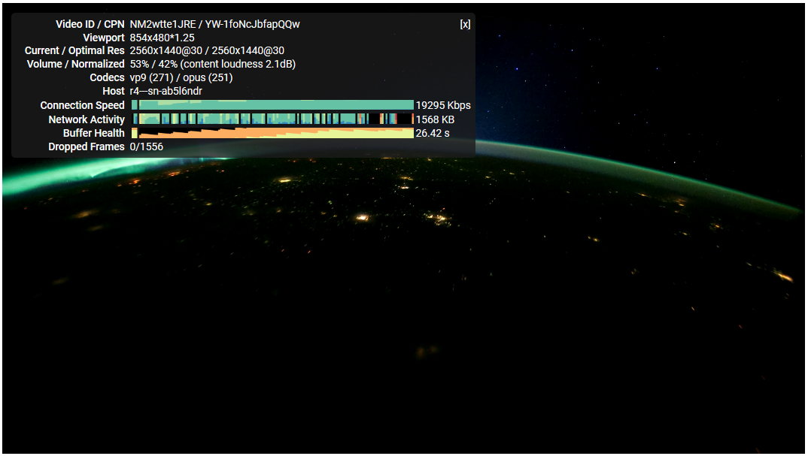
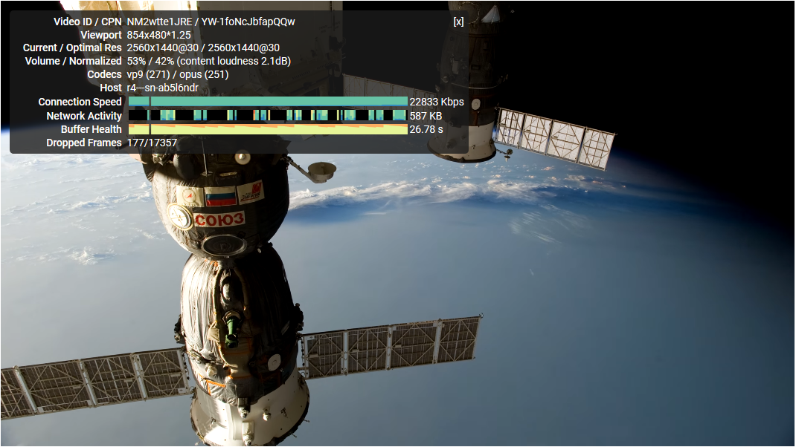

### UNICORN - 一个娇小的TC/UDP中继


基于asyncio，最终代码只有约250行，应该算是挺小的了，但是完整的实现了UDP/TCP的中继代理并且支持IPV6代理。使用了基于SOCKS5的自定义传输协议，支持 服务端<->客户端 的数据传输加密。目前实现了代理服务器端程序，以及一个基于此代理协议实现的SOCKS5客户端程序（客户端暂未实现UDP转发）。后续会继续实现其他功能。

### 并不能说明什么的测试
> 中国移动20M宽带，无线网络连接，1440P，测试日期：2018.2.14，除夕前一天，服务器位于美国。
> 
> 测试时间：17:39 分，下午5点。



> 播放了 N (5 < N <15)分钟以后



### 简易使用方法
> 服务器端 `unicorn.py`
```bash
# 参数请用 `:` 分割, 分别是监听地址:监听端口:密码
$> python3 unicorn.py 0.0.0.0:2365:MY_PASSWD
```
> 客户端 `u2socks5.py`
```bash
# 参数分为两串, 第一串表示本地SOCKS5监听的地址
# 第二串表示中继服务器的地址:监听端口:密码
$> python3 u2socks5.py 127.0.0.1:1080 12.12.12.12:2365:SERVER_PASSWD
```

### 依赖 / 平台
可以正常运行于安装了 `Python 3.4 +` 版本的Windows/Linux。如果无需传输加密的话，无依赖任何第三方包。默认依赖 pycrypto。

### 原理

> 工作原理类似 Shadowsocks，看图理解不多赘述。


### 协议

 请求/响应的数据包都有着以下的结构，底列代表字段长度（字节数）

 > 需要知道的是，进入TCP中继模式后，数据包没有上述格式，所有数据都是原封转发。

    |  SIGN  | CMD/FRAG/ERR | ATYPE | ALEN | ADDR | PORT | DATA |
    |-----------------------------------------------------------|
    |   `PK`  |       1      |   1   |   1  |  ..  |  2   |  ..  |

  * `SIGN` 一个用来识别包的特征值，它是一个常量`PK`（两字节ASCII，`PACKET`）
  * `CMD/FRAG/ERR` 协议为TCP时该字段表示请求命令，否则代表UDP包序号，UDP包排序不进行实现，所以该字段无效
  * `ATYPE` 地址类型[ADDR_DOMAIN, ADDR_IPV4, ADDR_IPV6]
  * `ALEN` 仅地址类型为 ADDR_DOMAIN（域名） 时才有效，代表域名长度
  * `ADDR` 目的/源地址, ipv4为4字节，ipv6为16字节，域名则依据 ALEN 取值
  * `PORT` 目的/源端口，两个字节
  * `DATA` 仅协议为UDP或者请求命令为PING时才会出现

### 响应
以后写...
